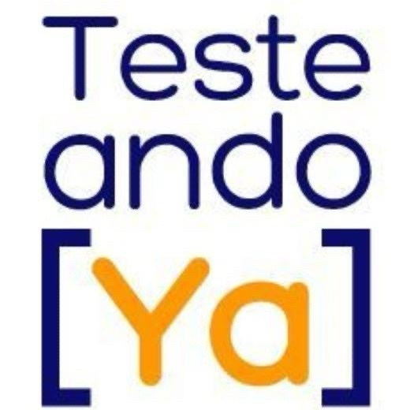

# Curso autodidacta SSTQB Foundation Level 4

Este es un curso autodidacta y práctico para preparar el examen oficial **SSTQB Foundation Level 4**, adaptado a un ritmo semanal de **5 a 8 horas**. Está dividido en **12 temas**, cada uno con contenidos teóricos, tutorial paso a paso y ejercicios prácticos para afianzar los conocimientos.

El enfoque es pedagógico, evolutivo y orientado a personas que deseen aprender desde cero, reforzar conceptos o prepararse de forma autodidacta. Se integran también buenas prácticas de desarrollo, automatización y herramientas modernas, en la medida que el temario oficial lo permite.

---

## Temario

| Tema   | Contenido                                                            |
|--------|----------------------------------------------------------------------|
| 1      | [Introducción al testing: principios, proceso y roles del tester](./Tema01/readme.md)     |
| 2      | [Psicología del testing, ética profesional y habilidades clave](./Tema02/readme.md) [🛒](https://hotmart.com/es)       |
| 3      | [Ciclo de vida del software, niveles y tipos de pruebas](./Tema03/readme.md)              |
| 4      | [Pruebas estáticas: revisiones, walkthroughs y análisis estático](./Tema04/readme.md)     |
| 5      | [Técnicas de diseño: caja negra, caja blanca y basadas en experiencia](./Tema05/readme.md)|
| 6      | [Gestión de pruebas: planificación, estimación y trazabilidad](./Tema06/readme.md)        |
| 7      | [Seguimiento del progreso, métricas, cobertura y control de calidad](./Tema07/readme.md)  |
| 8      | [Gestión de defectos, riesgos y mejora continua](./Tema08/readme.md)                      |
| 9      | [Herramientas de testing: selección, integración y automatización](./Tema09/readme.md)    |
| 10     | [Pruebas no funcionales: rendimiento, usabilidad, seguridad y más](./Tema10/readme.md)    |
| 11     | [Testing en DevOps: CI/CD, pipelines y automatización práctica](./Tema11/readme.md)       |
| 12     | [Preparación al examen: simulacro, repaso y consejos finales](./Tema12/readme.md)         |
| 13     | [Bonus track: Herramientas Avanzadas e Integración en Testing](./Tema13/readme.md)         |

---

## Bonus track: autoevaluaciones

Incluye **cinco exámenes tipo test** diseñados para validar tu preparación real. Cada prueba está estructurada como el examen oficial SSTQB FL 4, aunque con la mitad de preguntas.

- [examen 01](./bonus-track/01-examen.md): Test de 20 preguntas tras el tema 4.
- [examen 02](./bonus-track/02-examen.md): Test de 20 preguntas tras el tema 8.
- [examen 03](./bonus-track/03-examen.md): Test de 20 preguntas tras el tema 11.
- [examen 04](./bonus-track/04-examen.md): Simulacro de 20 preguntas con tiempo límite recomendado (30 minutos).
- [examen 05](./bonus-track/05-examen.md): Simulacro de 20 preguntas con tiempo límite recomendado (30 minutos).

---

## Requisitos

- No se requieren conocimientos previos de testing.
- Se recomienda tener acceso a un entorno local de desarrollo.
- Algunos temas requieren conexión a internet para acceder a herramientas o entornos de prueba públicos.

---

## Audiolibro

Este curso ofrece un método alternativo de aprendizaje en formato audiolibro, útil para reforzar los conceptos clave sin necesidad de código.

Puedes abrir el archivo principal [index.html](./audiobook/index.html) en tu navegador para comenzar a escuchar.

### Cómo usarlo

1. Inicia un servidor local (Windows: run.bat, Mac/Linux: run.sh)
1. Abre el archivo en un navegador moderno (Chrome, Edge, Firefox).  
2. Selecciona la lección desde el menú desplegable.  
3. El texto se mostrará en pantalla y podrás reproducirlo para que sea leído en voz alta.  

### Notas

- Cada archivo contiene el contenido de la lección en texto plano para facilitar la lectura y comprensión.  
- La síntesis de voz usa la API nativa del navegador, sin requerir conexión externa.  

---

## Licencia

Este curso está registrado en Safe Creative y licenciado bajo:

[**🛡️ Safe Creative: Registro de Derechos**](https://www.safecreative.org)  
[**🪪 Creative Commons BY-NC-ND 4.0 Internacional**](http://creativecommons.org/licenses/by-nc-nd/4.0/)

> Puedes **compartir** el contenido con atribución, pero **no modificarlo ni utilizarlo con fines comerciales**.  
> Cualquier uso comercial requiere **acuerdo previo por escrito** con el autor.

---

© 2025 Diego González Fernández  
[LinkedIn](https://www.linkedin.com/in/diego-gonzalez-fernandez)
